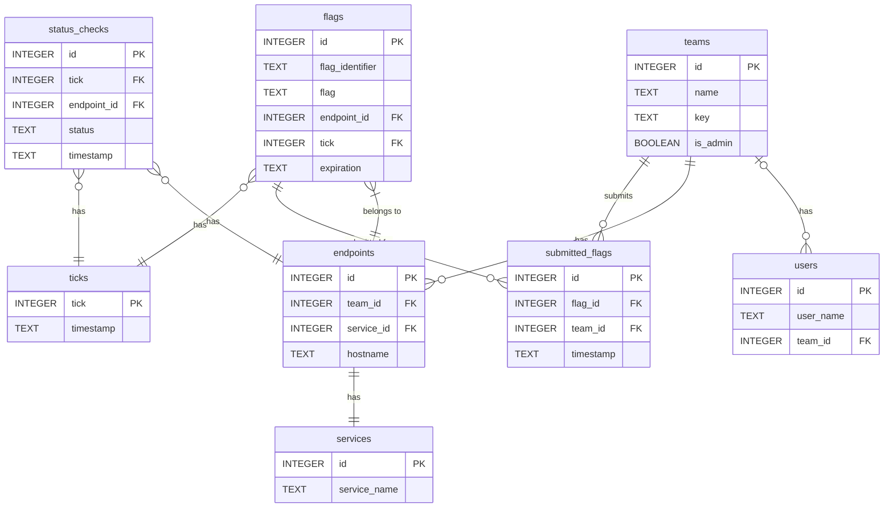

# Database Structure



## Useful Queries

Select all submitted flags, joined with data from the flags table.

```sql
SELECT *
FROM submitted_flags
JOIN flags ON submitted_flags.flag_id = flags.id;
```

Select all submitted flags, joined with data from the flags, teams, and endpoints tables

```sql
SELECT *
FROM submitted_flags
JOIN flags ON submitted_flags.flag_id = flags.id
JOIN teams ON submitted_flags.team_id = teams.id
JOIN endpoints on flags.endpoint_id = endpoints.id;
```

Select all teams and their members

```sql
SELECT teams.*, users.user_name
FROM teams
JOIN users ON teams.id = users.team_id;
```

Select service and endpoint information

```sql
SELECT service_id, service_name, hostname
FROM services
JOIN endpoints ON services.id = endpoints.service_id;
```

Select information for a submitted flag:

```sql
SELECT submitted_flags.team_id, submitted_flags.timestamp, flags.flag_identifier, flags.flag, flags.endpoint_id, flags.expiration
FROM submitted_flags
JOIN flags ON submitted_flags.flag_id = flags.id
WHERE submitted_flags.id = 1;
```

Select status checks for specific team during max tick:

```sql
SELECT *
FROM status_checks
JOIN endpoints ON status_checks.endpoint_id = endpoints.id
WHERE tick = (SELECT MAX(id) FROM ticks) AND endpoints.team_id = 1;
```

Select endpoints (API endpoint):

```sql
SELECT endpoints.team_id, endpoints.service_id, services.service_name, endpoints.hostname
FROM endpoints
JOIN services ON endpoints.service_id = services.id;
```

Select live flag information (API endpoint):

```sql
SELECT flags.flag_identifier, teams.id, endpoints.service_id, flags.expiration, endpoints.hostname
FROM flags
JOIN endpoints ON flags.endpoint_id = endpoint_id
JOIN teams ON endpoints.team_id = teams.id
WHERE flags.expiration > datetime('now');
```

Select submissions (API endpoint):

```sql
SELECT flags.flag, endpoints.team_id, endpoints.service_id, submitted_flags.timestamp
FROM submitted_flags
JOIN flags on submitted_flags.flag_id = flags.id
JOIN endpoints on flags.endpoint_id = endpoints.id
WHERE submitted_flags.team_id = 1;
```

Get status (API endpoint) **missing availability information**:

```sql
SELECT teams.name, teams.id, endpoints.hostname, endpoints.service_id, services.service_name
FROM teams
JOIN endpoints ON teams.id = endpoints.team_id
JOIN services ON endpoints.service_id = services.id
WHERE teams.id = '1';
```
